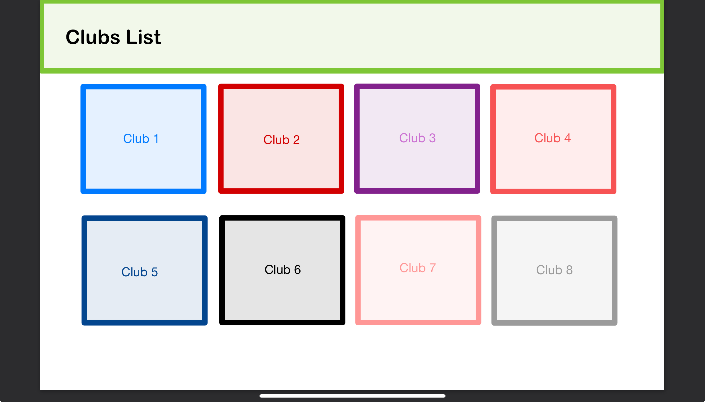

<h1>Da Club</h1>

Da Club
* <i>subjected to change</i>

<h2>Overview</h2>
<b><i>The problem:</i></b> UH Manoa has over 200 <a href="https://manoa.hawaii.edu/studentlife/involvement/registered-independent-organizations/">Registered Independent Organizations</a>, plus many more that do not have this “official” status but are nonetheless active organizations. Unfortunately, there is no easy way for students to learn (a) what student clubs (both registered and unregistered) exist, what they do, and how to get further involved.

<b><i>The solution:</i></b> The Club Hub application will provide a centralized directory for UH Manoa student clubs. UH Manoa students can login to browse a well organized directory of all current student clubs, with brief descriptions, meeting times and locations, URLs to their websites (if any), contact information for officers, and a few select photos.

<h2>Approach</h2>
Club Hub will have three user roles, all of them would login with their UH ID. 
  <ul>
    <li>Regular users would be able to only browse the directory</li>
    <li>Club Admins have the ability to edit the data associated with their club.</li>
    <li>Super Admins make sure site content is appropriate and grant "club admin" privileges to selected users.</li>
  </ul>
Addition to that, users are able to not only view the directory of clubs but be able to filter the directory to be able to find clubs that associate with different interest areas. For example, "athletic" clubs, "art" clubs, "music" clubs, etc. A club can belong to multiple interest areas.

Some possible mockup pages include:

<h2>Sign up Page</h2>
An Sign up form to create an account.

<h2>Sign in Page</h2>
An sign page form to sign in.

<h2>Landing page</h2>
An Landing page after you have signed in.

<h2>Add club</h2>

An add form to add a club as a club admin. Filling out the respective prompts.

<h2>List club</h2>

A page that lists all of the clubs in a compact manner.

Future Features: 
<h2>Friends List</h2>

A page that shows other users who have been added as members

<h2>Team</h2>
Da Club is designed, implemented, and maintained by <a href="https://github.com/Dodie-Mad">Dodie Madriaga</a>, <a href="https://github.com/edenkp">Eden K. Parungao</a>, <a href="https://github.com/jaked332">Jake Dickinson</a>, <a href="https://github.com/JaySaga22">Jayden Sagayaga</a>, and <a href="https://github.com/Nate2389">Nathan Chee</a>.
<h2>Team Contract</h2>
Our team has developed a <a href="https://docs.google.com/document/d/1PiApV3qOrppXNGaRf1kudZ24YolmkLwuc0Uw49lqp0w/edit?usp=sharing">Team Contract</a> to establish clear expectations within the group. The contract outlines several criteria, such as each member’s contributions and behaviors, and includes solutions to conflicts that may arise during our time as a group. If a member fails to meet the agreed-upon terms, there will be a process to attempt to de-escalate the situation. If that does not work, it will be escalated to the instructor.
<h2>Milestones</h2>
<ul>
  <li><a href="https://github.com/orgs/ics-314-code-crew/projects/1">Milestone 1</a></li>
  <li><a href="https://github.com/orgs/ics-314-code-crew/projects/5">Milestone 2</a></li>
  <li>Milestone 3</li>
</ul>
<h2>Deployment</h2>
Link to running <a href="https://daclub-ruddy.vercel.app/">Vervel</a>.
