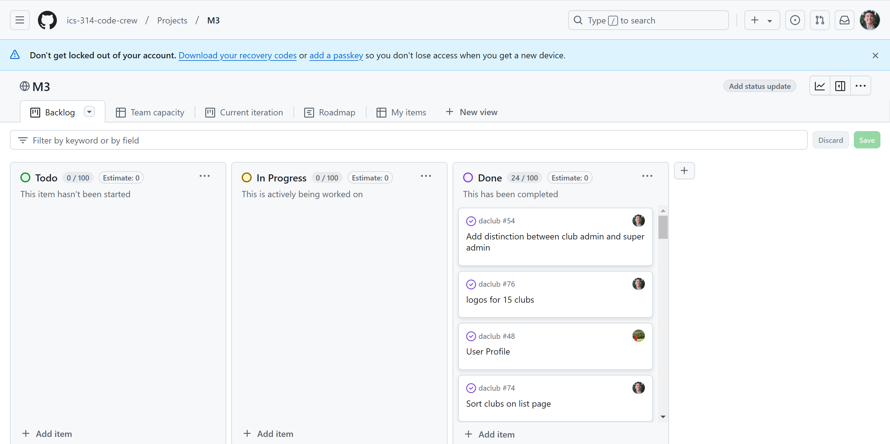

<h1>Da Club</h1>

<h2>Overview</h2>
<b><i>The problem:</i></b> UH Manoa has over 200 <a href="https://manoa.hawaii.edu/studentlife/involvement/registered-independent-organizations/">Registered Independent Organizations</a>, plus many more that do not have this “official” status but are nonetheless active organizations. Unfortunately, there is no easy way for students to learn (a) what student clubs (both registered and unregistered) exist, what they do, and how to get further involved.

<b><i>The solution:</i></b> The Club Hub application will provide a centralized directory for UH Manoa student clubs. UH Manoa students can login to browse a well organized directory of all current student clubs, with brief descriptions, meeting times and locations, URLs to their websites (if any), contact information for officers, and a few select photos.

<h2>Approach</h2>
Club Hub will have three user roles, all of them would login with their UH ID. 
  <ul>
    <li>Regular users would be able to only browse the directory</li>
    <li>Club Admins have the ability to edit the data associated with their club.</li>
    <li>Super Admins make sure site content is appropriate and grant "club admin" privileges to selected users.</li>
  </ul>
Addition to that, users are able to not only view the directory of clubs but be able to filter the directory to be able to find clubs that associate with different interest areas. For example, "athletic" clubs, "art" clubs, "music" clubs, etc. A club can belong to multiple interest areas.

Some possible mockup pages include:

<h2>Sign up Page</h2>
An Sign up form to create an account.

<h2>Sign in Page</h2>
An sign page form to sign in.

<h2>Landing Page</h2>
An Landing page after you have signed in.

<h2>Add Club</h2>

An add form to add a club as a club admin. Filling out the respective prompts.

<h2>List Club</h2>

A page that lists all of the clubs in a compact manner.

<h2>Installation</h2>

Here are the directions to accessing our app:

Go to our <a href="https://github.com/ics-314-code-crew/daclub">Project Repo</a>. Click on the Code button to and you can either open with github desktop or download a zip file.

Once you have it in you computer, go to your terminal and input the commands:

npm install

Then finally type this command into the terminal:

npm run dev

This should take you to a http://localhost:3000 which will openup the app in your brower.

<h1>Milestone 1</h1>

<h2>Landing Page<h2>

<h2>Sign In Page<h2>

<h2>Sign Out Page<h2>

<h2>Change Password Page<h2>

<h2>Sign Up Page<h2>

<h1>Milestone 2</h1>

<h2>Updated Landing Page</h2>

<h2>Adding a Club</h2>
<h3>Top of then Add Club Form</h3>

<h3>Bottom of then Add Club Form</h3>

<h2>Club List Page</h2>

<h2>Editing a Club</h2>
This page for club admins when they want to make changes to their club's information.
<h3>Managing Club Page</h3>

<h3>Top of the Edit Club Form</h3>

<h3>Bottom of the Edit Club Form</h3>

<h2>More details of the Club Page</h2>

<h1>Milestone 3</h1>

<h2>Updated Landing Page</h2>
<h3>For Unauthenticated Users</h3>

<h3>For Authenticated Users</h3>

<h2>Updated Sign In Page</h2>

<h2>Adding a Club</h2>
...

<h2>Editing a Club</h2>

Site Admins or Club Owners can Edit clubs.

Then the user can modify pre-filled fields:

<h2>Club List</h2>
<h3>Search</h3>

All site users can utilize the semantic search functionality and search for clubs based on name or interest areas. For example:

<h3>Copy to Clipboard!</h3>

For streamlining access to information. Users can copy club admin emails with a button.

<h2>Review Form</h2>

Here is the <a href="https://docs.google.com/forms/d/e/1FAIpQLSfkbjbfGLN90bl0CNdPvrDSTuAIf0_C34MfQDvW4K79vFWJkA/viewform?usp=sf_link">form to review our app</a>.

<h2>Community Feedback</h2>

Of the feedback given, DaClub seems to accomplish its objective of being a central directory for UH Manoa's student clubs. The community feedback given points out the sites ease of use and navigation of pages and features. Clubs were able to be presented in a neat and aesthetic fashion. When it came to functionality, the users commented on the minimalistic and intuitive approach in the features, noting how easy it was to sign up, edit profiles, and even chaning passwords

<h2>Team</h2>
Da Club is designed, implemented, and maintained by <a href="https://github.com/Dodie-Mad">Dodie Madriaga</a>, <a href="https://github.com/edenkp">Eden K. Parungao</a>, <a href="https://github.com/jaked332">Jake Dickinson</a>, <a href="https://github.com/JaySaga22">Jayden Sagayaga</a>, and <a href="https://github.com/Nate2389">Nathan Chee</a>.
<h2>Team Contract</h2>
Our team has developed a <a href="https://docs.google.com/document/d/1PiApV3qOrppXNGaRf1kudZ24YolmkLwuc0Uw49lqp0w/edit?usp=sharing">team contract</a> to establish clear expectations within the group. The contract outlines several criteria, such as each member’s contributions and behaviors, and includes solutions to conflicts that may arise during our time as a group. If a member fails to meet the agreed-upon terms, there will be a process to attempt to de-escalate the situation. If that does not work, it will be escalated to the instructor.
<h2>Milestones</h2>
<ul>
  <li><a href="https://github.com/orgs/ics-314-code-crew/projects/1">Milestone 1</a></li>
  <li><a href="https://github.com/orgs/ics-314-code-crew/projects/5">Milestone 2</a></li>
  <li><a href="https://github.com/orgs/ics-314-code-crew/projects/8">Milestone 3</a></li>
</ul>
<h2>Deployment</h2>
Link to running <a href="https://daclub-omega.vercel.app/">Vercel</a>.
<h2>GitHub Organization</h2>
<a href="https://github.com/ics-314-code-crew">View organization on GitHub</a>.
